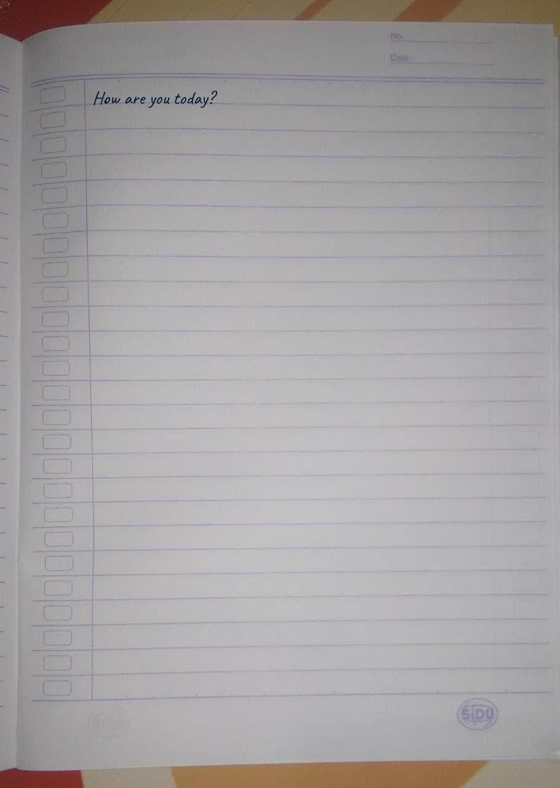
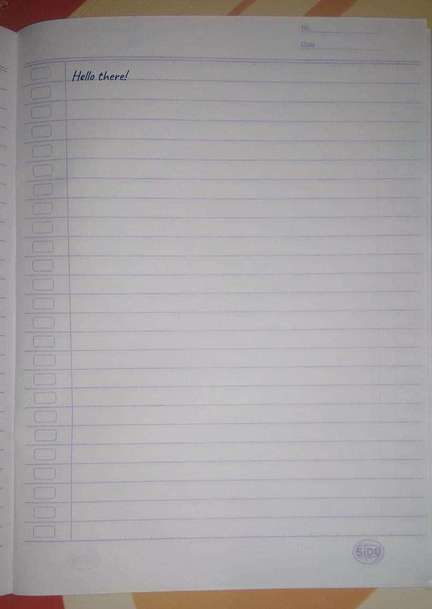

---

# ✍️ Telegram Handwriting Bot

Welcome to the Telegram Handwriting Bot ! 📝 This bot allows you to send messages as if they were handwritten on paper, adding a personal touch to your conversations .

## 🎨 Features

- Realistic Handwriting : Get handwritten messages that resemble natural handwriting .
- User-Friendly Interface : Easy-to-use interface for sending and receiving handwritten messages .

## 📸 Examples

*Handwritten message: "Hello there!"*

*Handwritten message: "How are you today?"*

## 📢 Feedback

We're always looking to improve! If you have any feedback or suggestions, feel free to reach out to us .

## 🌟 Contributors

- Telegram: [@u_l_w](https://t.me/u_l_w)
- Email: [iam982922@gmail.com](mailto:iam982922@gmail.com)
- Telegram Channel: [AhmedTools](https://t.me/ahmedtools)
- GitHub: [ahmedtools](https://github.com/ahmedtools)

Feel free to contact me on any of these platforms ! 🚀

---
